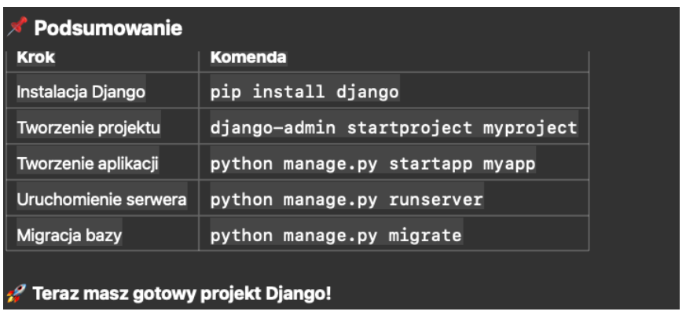

-------------------
<b> - Bold text
<strong> - Important text
<i> - Italic text
<em> - Emphasized text
<mark> - Marked text
<small> - Smaller text
<del> - Deleted text
<ins> - Inserted text
 - Subscript text
 - Superscript text

---- html----
Paleta kolorów rgb
https://doneta.pl/blog/paleta-kolorow-rgb/

Hierarchia selektorów (od najmniejszego do największego priorytetu):
 1. Elementy (np. div, p) → najmniej specyficzne.
 2. Klasy (np. .example) → średni priorytet.
 3. Identyfikatory (np. #example) → wysoki priorytet.
 4. Style inline (np. style="color: red;") → najwyższy priorytet.
 5. Reguła !important (np. color: red !important;) → nadpisuje wszystko.

wagi dla arkuszy styli
Specyficzność jest obliczana na podstawie “wag”:
	•	Identyfikator (id): #id → specyficzność: 100.
	•	Klasa: .class → specyficzność: 10.
	•	Element HTML: div, p → specyficzność: 1.

 - linia odzielająca bloki

Aby strona poprawnie wyświetlała się przy zmianie szerokości okna
<meta name="viewport" content="width=device-width, initial-scale=1.0">

# cwiczenia
https://cssgridgarden.com/#pl
https://flexboxfroggy.com/#pl
https://flukeout.github.io/
https://edabit.com/challenges
https://devcorner.pl/gry-napisane-w-css/

--- znaki specjalne w html ----
https://ifj.edu.pl/private/krawczyk/kurshtml/znaki/znaki.htm

# fastApi
https://fastapi.tiangolo.com/pl/tutorial/

# statusy http
https://pl.wikipedia.org/wiki/Kod_odpowiedzi_HTTP

-------------------
<b> - Bold text
<strong> - Important text
<i> - Italic text
<em> - Emphasized text
<mark> - Marked text
<small> - Smaller text
<del> - Deleted text
<ins> - Inserted text
 - Subscript text
 - Superscript text

https://cssgridgarden.com/#pl
https://flexboxfroggy.com/#pl
https://flukeout.github.io/
https://edabit.com/challenges

---- html----
Paleta kolorów rgb
https://doneta.pl/blog/paleta-kolorow-rgb/

Hierarchia selektorów (od najmniejszego do największego priorytetu):
 1. Elementy (np. div, p) → najmniej specyficzne.
 2. Klasy (np. .example) → średni priorytet.
 3. Identyfikatory (np. #example) → wysoki priorytet.
 4. Style inline (np. style="color: red;") → najwyższy priorytet.
 5. Reguła !important (np. color: red !important;) → nadpisuje wszystko.

wagi dla arkuszy styli
Specyficzność jest obliczana na podstawie “wag”:
	•	Identyfikator (id): #id → specyficzność: 100.
	•	Klasa: .class → specyficzność: 10.
	•	Element HTML: div, p → specyficzność: 1.
Aby strona poprawnie wyświetlała się przy zmianie szerokości okna
<meta name="viewport" content="width=device-width, initial-scale=1.0">

 - dziedziczenie w plikach html za pomoca jinja

 - linia odzielająca bloki
{{ super() }} - wykonnaie kodu z klasy wyzszej
 - dołaczenie jednego szblonu do drugiego

--- znaki specjalne w html ----
https://ifj.edu.pl/private/krawczyk/kurshtml/znaki/znaki.htm
---botstrap---
w-100 - wypełnij pole w 100%

btn-primary: Podstawowy przycisk, używany do wyróżnienia głównego działania na stronie.
btn-secondary: Stosowany dla działań mniej priorytetowych niż te dla btn-primary.
btn-success: Wskazuje na pomyślną akcję, np. zakończenie formularza czy potwierdzenie.
btn-danger: Używany do działań, które mogą być destrukcyjne, jak usunięcie czy anulowanie.
btn-warning: Sygnalizuje użytkownikowi ostrzeżenie, które może wymagać dodatkowej uwagi.
btn-info: Może być używany do przekazania dodatkowych informacji użytkownikowi.
btn-light: Jasny przycisk, który dobrze kontrastuje z ciemnym tłem.
btn-dark: Ciemny przycisk, który dobrze kontrastuje z jasnym tłem.
btn-link: Przycisk stylizowany jako link, bez tła i obramowania, ale zachowuje właściwości przycisku.

https://flask-login.readthedocs.io/en/stable/

